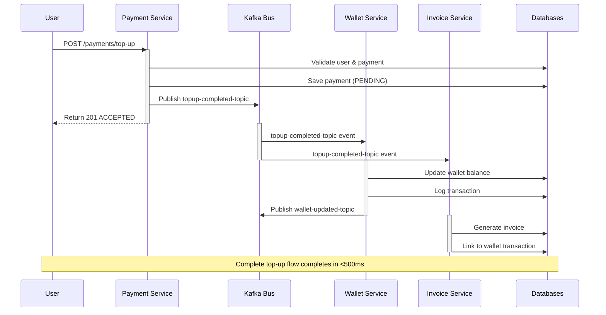

# HK Fintech Platform - Comprehensive README

> A modern, event-driven microservices platform for digital wallet, card payments, and financial transactions.

## 📋 Quick Navigation

- [Project Overview](#project-overview)
- [Business Use Case](#business-use-case)
- [System Architecture](#system-architecture)
- [Technology Stack](#technology-stack)
- [Getting Started](#getting-started)
- [API Documentation](#api-documentation)
- [Event Flow & Process](#event-flow--process)
- [Observability & Monitoring](#observability--monitoring)
- [Deployment](#deployment)
- [Development Guide](#development-guide)
- [Troubleshooting](#troubleshooting)

---

## 🎯 Project Overview

**HK Fintech** is a production-grade, microservices-based financial platform designed to handle:

✅ **User Identity & Authentication** - User registration, verification, and authentication  
✅ **Digital Wallet Management** - Balance tracking, deposits, withdrawals  
✅ **Card Management** - Virtual/physical card creation and lifecycle management  
✅ **Payment Processing** - Direct payments, transfers, top-ups with rate limiting  
✅ **Invoice Generation** - Automated invoice creation and management  

### Key Characteristics

- **Event-Driven Architecture**: Services communicate via Apache Kafka
- **Database Per Service**: Complete data isolation between microservices
- **Saga Pattern**: Choreography-based distributed transactions
- **Outbox Pattern**: Guaranteed message delivery with exactly-once semantics
- **Rate Limiting**: Bucket4j-based request throttling
- **Enterprise Grade**: Spring Boot 3.1.5, Java 21, Docker, Kubernetes ready

---

## 💼 Business Use Case

### Problem Statement

HK Fintech solves the complex problem of managing **distributed financial transactions** across multiple domains:

1. **User Management**: KYC/AML verification and authentication
2. **Wallet Services**: Multi-currency balance management with real-time updates
3. **Card Issuance**: Digital card provisioning with transaction controls
4. **Payment Orchestration**: Complex multi-step payment flows with failure recovery
5. **Audit & Compliance**: Complete transaction history and audit trails

### Target Scenarios

#### 📱 User Top-Up Flow
```
User initiates top-up payment → Payment Service processes → Wallet balance updated → Event notification sent
```

#### 💳 Card Payment Flow
```
Card payment request → Payment Service validates → Wallet deducted → Invoice generated → Confirmation sent
```

#### 🔄 Distributed Payment (Multiple Services)
```
Payment initiated → Multiple validations → Saga orchestration → Success/Failure propagation → Wallet updates
```

### Business Value

- **Instant Settlement**: Event-driven architecture enables near real-time balance updates
- **Fault Tolerance**: Saga pattern manages distributed transaction failures gracefully
- **Scalability**: Microservices can scale independently based on demand
- **Auditability**: Outbox pattern ensures no lost transactions
- **Rate Limiting**: Prevents abuse and protects system resources

---

## 🏗️ System Architecture

### High-Level System Design

```
┌─────────────────────────────────────────────────────────────┐
│                    API Gateway / Load Balancer              │
└──────────────┬────────────────┬────────────────┬────────────┘
               │                │                │
        ┌──────▼────┐   ┌──────▼────┐   ┌──────▼────┐
        │ Identity   │   │  Payment   │   │  Card     │
        │ Service    │   │  Service   │   │  Service  │
        │ (KYC/Auth) │   │            │   │           │
        └──────┬────┘   └──────┬────┘   └──────┬────┘
               │                │                │
        ┌──────▼────┐   ┌──────▼────┐   ┌──────▼────┐
        │ Postgres   │   │ Postgres   │   │ Postgres  │
        │(identity_  │   │(payment_   │   │(card_db)  │
        │db)         │   │db)         │   │           │
        └────────────┘   └────────────┘   └───────────┘
               │
        ┌──────▼────┐   ┌──────────┐   ┌──────────┐
        │  Wallet    │   │ Invoice  │   │ Outbox   │
        │  Service   │   │ Service  │   │ Pattern  │
        │            │   │          │   │          │
        └──────┬────┘   └──────┬───┘   └──────┬───┘
               │                │              │
        ┌──────▼────┐   ┌──────▼────┐        │
        │ Postgres   │   │ Postgres   │        │
        │(wallet_db) │   │(invoice_db)│        │
        └────────────┘   └────────────┘        │
                 │                             │
        ┌────────▼─────────────────────────────▼────────┐
        │    Kafka Cluster (Zookeeper + Broker)         │
        │                                                │
        │  Topics:                                       │
        │  • user-created-topic                          │
        │  • payment-completed-topic                     │
        │  • topup-completed-topic                       │
        │  • wallet-failed-topic                         │
        │  • invoice-created-topic                       │
        └────────────────────────────────────────────────┘
                 │
        ┌────────▼──────────────┐
        │  ELK Stack            │
        │  ├─ Elasticsearch     │
        │  ├─ Logstash          │
        │  └─ Kibana            │
        └───────────────────────┘
```

### Microservices Breakdown

| Service | Port | Database | Key Responsibility |
|---------|------|----------|-------------------|
| **identity-service** | 8081 | identity_db | User KYC, auth, user creation |
| **wallet-service** | 8082 | wallet_db | Balance management, top-ups, withdrawals |
| **card-service** | 8083 | card_db | Card issuance, management, rate limiting |
| **payment-service** | 8084 | payment_db | Payment processing, validation, saga coordination |
| **invoice-service** | 8085 | invoice_db | Invoice generation, tracking |
| **common-lib** | - | - | Shared DTOs, utilities, constants |

### Architecture Patterns Used

#### 1. **Outbox Pattern** ✅
- Guarantees reliable message publishing
- Prevents message loss even if Kafka is down
- Located in each service's database
- `OutboxPublisher` scheduler polls outbox every second

```java
// OutboxPublisher periodically publishes queued messages
@Scheduled(fixedDelay = 1000)
public void publishPendingMessages() {
    kafkaTemplate.send(msg.getTopic(), msg.getPayload());
}
```

#### 2. **Saga Pattern (Choreography-Based)** 🔄
Services collaborate via event listening without a central orchestrator:

```
Payment Creation Request
    ↓
Payment Service publishes: "payment-completed-topic"
    ↓
Wallet Service listens & updates balance
    ↓
Wallet Service publishes: "wallet-updated-topic"
    ↓
Invoice Service listens & generates invoice
```

#### 3. **Database Per Service** 🗄️
Each microservice manages its own PostgreSQL database:
- Complete autonomy and independent scaling
- Eventual consistency vs strong consistency tradeoffs

#### 4. **Circuit Breaker & Resilience**
- Spring Cloud with circuit breaker patterns
- Graceful degradation on service failures
- Retry mechanisms with exponential backoff

---

## 🛠️ Technology Stack

### Backend
- **Framework**: Spring Boot 3.1.5
- **Language**: Java 21
- **Build Tool**: Maven 3.9+
- **Security**: Spring Security with JWT

### Data
- **Primary Database**: PostgreSQL 15-Alpine
- **Migration**: Flyway
- **ORM**: Spring Data JPA + Hibernate

### Messaging
- **Event Bus**: Apache Kafka 7.4.0
- **Coordination**: Zookeeper 7.4.0
- **Serialization**: JSON (Jackson)

### Observability
- **Logging**: Elasticsearch + Logstash + Kibana (ELK Stack)
- **Metrics**: Spring Boot Actuator
- **Health Checks**: Spring Boot Health Indicators
- **Log Aggregation**: Logstash pipelines

### DevOps
- **Containerization**: Docker
- **Orchestration**: Kubernetes (K8s manifests included)
- **Configuration Management**: ConfigMap, Secrets
- **Networking**: Kubernetes Service, Ingress

### Testing
- **Load Testing**: Gatling (in `load-test` module)
- **Integration Testing**: JUnit 5, Testcontainers
- **System Testing**: separate `system-test` module

### Libraries
- **Mapping**: MapStruct
- **Rate Limiting**: Bucket4j
- **Validation**: Jakarta Bean Validation
- **Logging**: SLF4J
- **Utilities**: Lombok

---

## 🚀 Getting Started

### Prerequisites

```bash
# Required
- Java 21 (OpenJDK recommended)
- Docker & Docker Compose 3.8+
- Maven 3.9+
- Git

# Optional (for K8s deployment)
- Kubernetes 1.24+
- kubectl CLI
- Helm 3.0+
```

### Local Development Setup

#### 1️⃣ Clone Repository
```bash
cd c:\-proje\hk-fintech
```

#### 2️⃣ Build Project
```bash
# Build all modules
mvn clean install -DskipTests

# Build specific service
mvn clean install -DskipTests -pl card-service -am
```

#### 3️⃣ Start Infrastructure (Docker Compose)
```bash
# Start all services (dev environment)
docker-compose up -d

# Verify all containers are running
docker-compose ps

# View logs
docker-compose logs -f

# For end-to-end testing
docker-compose -f docker-compose-e2e.yml up -d
```

#### 4️⃣ Verify Services Health
```bash
# Check individual service health
curl -s http://localhost:8081/actuator/health | jq .
curl -s http://localhost:8082/actuator/health | jq .
```

#### 5️⃣ Access Kibana Dashboard
```
🔗 http://localhost:5601

Default credentials: elastic / changeme
```

### Environment Variables

Create `.env` file at project root:

```bash
# Database Configuration
POSTGRES_USER=admin
POSTGRES_PASSWORD=admin
POSTGRES_VERSION=15-alpine

# Service Ports
IDENTITY_DB_PORT=5432
WALLET_DB_PORT=5433
CARD_DB_PORT=5434
PAYMENT_DB_PORT=5435
INVOICE_DB_PORT=5436

# Kafka
CONFLUENT_VERSION=7.4.0

# Elasticsearch
ELASTIC_PASSWORD=changeme
```

---

## 📡 API Documentation

### Service Endpoints Summary

#### 🔐 Identity Service (8081)

```bash
# User Management
GET    /api/v1/users/{id}/exists              # Check user existence
POST   /api/v1/auth/register                  # User registration
POST   /api/v1/auth/login                     # User login
POST   /api/v1/auth/verify                    # Email/Phone verification
```

#### 💳 Card Service (8083)

```bash
# Card Management
POST   /api/v1/cards                          # Create new card
GET    /api/v1/cards                          # List user cards
GET    /api/v1/cards/{cardId}                 # Get card details
PUT    /api/v1/cards/{cardId}                 # Update card
DELETE /api/v1/cards/{cardId}                 # Deactivate card

# Rate Limits
- Card Creation: 5 requests per minute
- Card Listing: 20 requests per minute
```

#### 💰 Wallet Service (8082)

```bash
# Wallet Operations
GET    /api/v1/wallets/user/{userId}         # Get user wallet
POST   /api/v1/wallets/top-up                # Top-up balance
POST   /api/v1/wallets/withdraw              # Withdraw funds
GET    /api/v1/wallets/user/{userId}/history # Transaction history
```

#### 💸 Payment Service (8084)

```bash
# Payment Processing
POST   /api/v1/payments                      # Create payment
POST   /api/v1/payments/top-up               # Top-up payment
GET    /api/v1/payments/{paymentId}          # Get payment status
GET    /api/v1/payments/user/{userId}        # User payment history
```

#### 📄 Invoice Service (8085)

```bash
# Invoice Management
POST   /api/v1/invoices                      # Create invoice
GET    /api/v1/invoices/{invoiceId}          # Get invoice details
GET    /api/v1/invoices/user/{userId}        # List user invoices
```

### Authentication

All endpoints require JWT token (except `/auth/login` and `/auth/register`):

```bash
curl -H "Authorization: Bearer {JWT_TOKEN}" \
     http://localhost:8082/api/v1/wallets/user/1
```

### Example: Complete Top-Up Flow

```bash
# 1. Create Payment (via Payment Service)
curl -X POST http://localhost:8084/api/v1/payments/top-up \
  -H "Authorization: Bearer {token}" \
  -H "Content-Type: application/json" \
  -d '{
    "amount": 100,
    "currency": "USD",
    "paymentMethod": "CREDIT_CARD",
    "cardId": 1
  }'

# 2. Subscribe to completion event (Kafka consumer logs)
docker-compose logs -f payment-service | grep "topup-completed-topic"

# 3. Verify wallet updated
curl -H "Authorization: Bearer {token}" \
     http://localhost:8082/api/v1/wallets/user/1
```

---

## 🔄 Event Flow & Process

### Complete Transaction Flow: Top-Up Payment



### Event Topics & Subscribers

| Topic | Publisher | Subscribers | Event Format |
|-------|-----------|-------------|--------------|
| **user-created-topic** | Identity Service | Wallet Service | New user ID |
| **payment-completed-topic** | Payment Service | Wallet, Invoice Services | Payment details |
| **topup-completed-topic** | Payment Service | Wallet Service | Top-up details |
| **wallet-failed-topic** | Wallet Service | Identity Service | Failure reason |
| **invoice-created-topic** | Invoice Service | Wallet Service | Invoice metadata |

### Failure Scenarios & Recovery

#### ❌ Scenario 1: Wallet Service Down

```
Payment created → Kafka message published to outbox table
                ↓
              (Wallet service down)
                ↓
         OutboxPublisher retries every 1 second
                ↓
         Wallet service comes back up
                ↓
         OutboxPublisher successfully publishes
                ↓
         Wallet balance updated (eventual consistency)
```

#### ❌ Scenario 2: Payment Validation Fails

```
User top-up request
    ↓
Payment Service detects insufficient funds
    ↓
Payment marked as FAILED in DB
    ↓
wallet-failed-topic published
    ↓
Identity Service notified
    ↓
User gets error response
```

### Saga Pattern: Choreography vs Orchestration

⚠️ **Current Pattern: Choreography**

```
Service 1 does work → publishes event
                ↓
Service 2 listens, does work → publishes event
                ↓
Service 3 listens, does work → publishes event
```

**Pros**: Loosely coupled, simple, direct
**Cons**: Harder to track, complex error handling

**Future Consideration**: Could migrate to Orchestration pattern with:
- Dedicated Saga Orchestrator service
- Spring Cloud Config Server for distributed tracing
- Temporal/Cadence for workflow management

---

## 📊 Observability & Monitoring

### Logging: ELK Stack (Elasticsearch, Logstash, Kibana)

#### Architecture

```
Services (Spring Boot + SLF4J)
         ↓
   Logstash (Pipeline)
         ↓
Elasticsearch (Indexed logs)
         ↓
  Kibana Dashboard
```

#### Access Kibana

```
🔗 http://localhost:5601
```

#### Available Dashboards

1. **Transaction Overview**: Real-time payment/top-up metrics
2. **Error Tracking**: Failed transactions, validation errors
3. **Performance**: Response times, throughput
4. **Service Health**: Uptime, restart events

#### Example Log Queries

```json
// Find all failed payments
{
  "query": {
    "match": {
      "status": "FAILED"
    }
  }
}

// Payments in last hour
{
  "query": {
    "range": {
      "timestamp": {
        "gte": "now-1h"
      }
    }
  }
}
```

### Metrics: Spring Boot Actuator

#### Health Checks

```bash
# Overall health
curl http://localhost:8084/actuator/health

# Detailed health
curl http://localhost:8084/actuator/health/details

# Kafka connectivity
curl http://localhost:8084/actuator/health/kafkaHealthIndicator

# Database connectivity
curl http://localhost:8084/actuator/health/db
```

#### Metrics Endpoints

```bash
# All metrics
curl http://localhost:8084/actuator/metrics

# JVM memory
curl http://localhost:8084/actuator/metrics/jvm.memory.used

# HTTP requests
curl http://localhost:8084/actuator/metrics/http.server.requests
```

### Distributed Tracing (Future Enhancement)

Recommended additions:
- **Spring Cloud Sleuth** + **Jaeger**: Distributed tracing
- **Micrometer**: Prometheus-compatible metrics
- **Custom correlation IDs**: Track requests across services

---

## ☸️ Deployment

### Docker Compose (Development/Testing)

```bash
# Start all services
docker-compose up -d

# Start only E2E testing environment
docker-compose -f docker-compose-e2e.yml up -d

# View specific service logs
docker-compose logs -f payment-service

# Stop all services
docker-compose down

# Clean up volumes (⚠️ Removes data)
docker-compose down -v
```

### Kubernetes (Production)

#### Cluster Setup

```bash
# Apply namespace
kubectl apply -f k8s/namespace.yaml

# Deploy infrastructure (Kafka, PostgreSQL, Zookeeper)
kubectl apply -f k8s/infrastructure/

# Deploy application services
kubectl apply -f k8s/services/

# Deploy ingress
kubectl apply -f k8s/ingress.yaml

# Deploy HPA (auto-scaling)
kubectl apply -f k8s/services/hpa.yaml
```

#### Verify Deployment

```bash
# Check all pods
kubectl get pods -n hk-fintech

# View service endpoints
kubectl get svc -n hk-fintech

# Check ingress
kubectl get ingress -n hk-fintech

# Stream logs from payment service
kubectl logs -f deployment/payment-service -n hk-fintech
```

#### Troubleshooting K8s Deployment

```bash
# Pod is stuck in Pending
kubectl describe pod payment-service-xxx -n hk-fintech

# Check resource usage
kubectl top pods -n hk-fintech

# Access pod shell
kubectl exec -it payment-service-xxx -n hk-fintech -- /bin/bash
```

---

## 👨‍💻 Development Guide

### Project Structure

```
hk-fintech/
├── card-service/                 # Card management service
│   ├── src/main/java/com/hk/cardservice/
│   │   ├── controller/           # REST endpoints
│   │   ├── service/              # Business logic
│   │   ├── entity/               # JPA entities
│   │   ├── dto/                  # Request/Response DTOs
│   │   └── exception/            # Custom exceptions
│   └── pom.xml
│
├── payment-service/              # Payment processing
│   ├── src/main/java/.../paymentservice/
│   │   ├── kafka/
│   │   │   ├── producer/         # Kafka event publishing
│   │   │   └── consumer/         # Kafka event listening
│   │   ├── config/
│   │   │   └── KafkaTopicConfig.java
│   │   └── ...
│   └── pom.xml
│
├── wallet-service/              # Personal wallet management
│   ├── src/main/java/.../walletservice/
│   │   ├── kafka/
│   │   ├── scheduler/
│   │   │   └── OutboxPublisher.java
│   │   └── ...
│   └── pom.xml
│
├── identity-service/            # User authentication & KYC
├── invoice-service/             # Invoice generation
├── hk-common-lib/               # Shared libraries & DTOs
│
├── elk/
│   └── logstash/pipeline/        # Log processing rules
│
├── k8s/
│   ├── infrastructure/           # Kafka, PostgreSQL K8s manifests
│   ├── services/                 # Application K8s manifests
│   └── config/                   # ConfigMap, Secrets
│
├── load-test/                   # Gatling load tests
├── system-test/                 # Integration tests
│
├── docker-compose.yml           # Local dev environment
├── docker-compose-e2e.yml       # End-to-end testing
└── pom.xml                      # Parent POM
```

### Adding a New Feature (Example: Refund Processing)

#### Step 1: Define Event in hk-common-lib
```java
// hk-common-lib/src/main/java/com/hk/commonlib/event/RefundInitiatedEvent.java

public class RefundInitiatedEvent {
    private Long paymentId;
    private BigDecimal amount;
    private String reason;
    private LocalDateTime createdAt;
}
```

#### Step 2: Create Kafka Topic (Payment Service)
```java
// payment-service/src/main/java/.../config/KafkaTopicConfig.java

@Bean
public NewTopic refundInitiatedTopic() {
    return new NewTopic("refund-initiated-topic", 1, (short) 1);
}
```

#### Step 3: Publish Event (Payment Service)
```java
// payment-service/.../service/RefundService.java

@Service
@RequiredArgsConstructor
public class RefundService {
    private final OutboxRepository outboxRepository;
    
    public void initiateRefund(Long paymentId, BigDecimal amount) {
        // Validate and process refund
        RefundInitiatedEvent event = new RefundInitiatedEvent(...);
        
        // Save to outbox (guaranteed delivery)
        Outbox outbox = new Outbox("refund-initiated-topic", 
                                   objectMapper.writeValueAsString(event));
        outboxRepository.save(outbox);
    }
}
```

#### Step 4: Listen to Event (Wallet Service)
```java
// wallet-service/.../kafka/consumer/RefundInitiatedConsumer.java

@Service
@RequiredArgsConstructor
public class RefundInitiatedConsumer {
    private final WalletService walletService;
    
    @KafkaListener(topics = "refund-initiated-topic", groupId = "wallet-group-v1")
    public void handleRefundInitiated(String message) {
        RefundInitiatedEvent event = objectMapper.readValue(message, 
                                                           RefundInitiatedEvent.class);
        walletService.creditRefundAmount(event.getPaymentId(), event.getAmount());
    }
}
```

#### Step 5: Test
```bash
# Run integration tests
mvn test -Dgroups=integration

# Run load test
mvn gatling:execute -Dgatling.simulationClass=RefundSimulation
```

### Code Standards

- **Language**: Turkish variable/method names for business logic, English for technical code
- **Logging**: Use SLF4J with appropriate levels (DEBUG, INFO, WARN, ERROR)
- **Exceptions**: Custom exceptions extending `RuntimeException`
- **Validation**: Use Jakarta Bean Validation annotations
- **Mapping**: MapStruct for DTO conversions
- **Database**: Flyway migrations for schema changes

### Running Tests

```bash
# Unit & integration tests
mvn test

# Skip tests
mvn clean install -DskipTests

# Run specific test class
mvn test -Dtest=PaymentServiceTest

# With coverage report
mvn test jacoco:report
```

### Building Docker Images

```bash
# Build specific service image
mvn clean package -DskipTests -pl card-service
docker build -t hk-fintech/card-service:1.0.0 card-service/

# Build all and push to registry
mvn clean package -DskipTests
docker-compose build

# Run locally
docker-compose up -d
```

---

## 🔧 Troubleshooting

### Service Startup Issues

#### ❌ "Connection refused" on localhost:9092

```bash
# Kafka not running
docker-compose ps | grep kafka

# Start Kafka
docker-compose up -d kafka zookeeper

# Test connectivity
docker-compose exec kafka kafka-broker-api-versions.sh --bootstrap-server kafka:9092
```

#### ❌ "Datasource initialization failed"

```bash
# Check PostgreSQL logs
docker-compose logs postgres-payment

# Verify Flyway migrations
# Migrations should be in: src/main/resources/db/migration/

# Manual migration
docker-compose exec postgres-payment psql -U admin -d payment_db -c "\dt"
```

#### ❌ "ClassNotFoundException: KafkaTemplate"

```bash
# Verify kafka dependency in pom.xml
# Should include: spring-cloud-starter-stream-kafka
# OR: spring-kafka

mvn dependency:tree | grep kafka
```

### Performance Issues

#### Slow Payment Processing

1. **Check database indexes**
   ```sql
   SELECT * FROM pg_stat_user_indexes 
   WHERE schemaname = 'public' AND relname = 'payment';
   ```

2. **Monitor Kafka lag**
   ```bash
   docker-compose exec kafka kafka-consumer-groups.sh \
     --bootstrap-server localhost:9092 \
     --group payment-group \
     --describe
   ```

3. **Check rate limiting**
   - Bucket4j configuration in CardService
   - Adjust `RateLimitService.resolveBucket()` parameters

### Common Error Messages

| Error | Cause | Solution |
|-------|-------|----------|
| `Kafka broker not found` | kafka container not running | `docker-compose up -d kafka` |
| `Connection timeout to postgres` | DB not up yet | Wait 5-10 seconds; docker has health checks |
| `Outbox message stuck` | OutboxPublisher scheduler not running | Check `@EnableScheduling` annotation |
| `JWT token invalid` | Token expired or malformed | Re-login and get fresh token |
| `Rate limit exceeded` | Too many requests in time window | Wait before sending more requests |

---

## 📫 Infrastructure Monitoring

### Kafka Monitoring

```bash
# List all topics
docker-compose exec kafka kafka-topics.sh \
  --bootstrap-server localhost:9092 \
  --list

# Check topic details
docker-compose exec kafka kafka-topics.sh \
  --bootstrap-server localhost:9092 \
  --describe \
  --topic payment-completed-topic

# Monitor consumer lag
docker-compose exec kafka kafka-consumer-groups.sh \
  --bootstrap-server localhost:9092 \
  --describe \
  --group wallet-group-v1
```

### Database Monitoring

```bash
# Connect to payment DB
docker-compose exec postgres-payment \
  psql -U admin -d payment_db

# Inside psql
SELECT COUNT(*) FROM payment;
SELECT COUNT(*) FROM outbox WHERE processed = false;
SELECT * FROM pg_stat_statements ORDER BY mean_time DESC;
```

### Log Analysis

```bash
# Tail payment service logs in real-time
docker-compose logs -f --tail=100 payment-service

# Search for errors
docker-compose logs | grep -i error

# Count logs by level
docker-compose logs | grep "ERROR\|WARN" | wc -l
```

---

## 🔐 Security Considerations

### Current Implementation
- ✅ JWT token-based authentication
- ✅ Spring Security integration
- ✅ Rate limiting (Bucket4j)

### Recommended Enhancements
- [ ] SSL/TLS for all inter-service communication
- [ ] Service-to-service authentication (mTLS)
- [ ] Encryption at rest for sensitive data
- [ ] API key rotation strategy
- [ ] Audit logging for compliance

---

## 🚦 Status & Roadmap

### Current Status: ✅ MVP Ready
- Core microservices functional
- Event-driven architecture implemented
- Docker & K8s support
- Basic observability via ELK

### Short-Term (Next Sprint)
- [ ] Add distributed tracing (Sleuth + Jaeger)
- [ ] Implement circuit breakers
- [ ] Add more comprehensive Kibana dashboards
- [ ] Write load test scenarios

### Long-Term (Road Map)
- [ ] Multi-currency support
- [ ] Recurring payments
- [ ] Advanced fraud detection
- [ ] Machine learning for risk scoring
- [ ] API rate limiting per customer tier

---

## 📞 Support & Contact

- **Documentation**: [This README]
- **Issue Tracking**: GitHub Issues
- **Architecture Questions**: Refer to `/docs/ARCHITECTURE.md`
- **Deployment Guide**: `/docs/DEPLOYMENT.md`
- **Testing Guide**: `/docs/TESTING.md`

---

## 📄 License

Proprietary - HK Innovation Project

**Last Updated**: April 2026  
**Maintained By**: HK Fintech Team  
**Version**: 1.0.0

